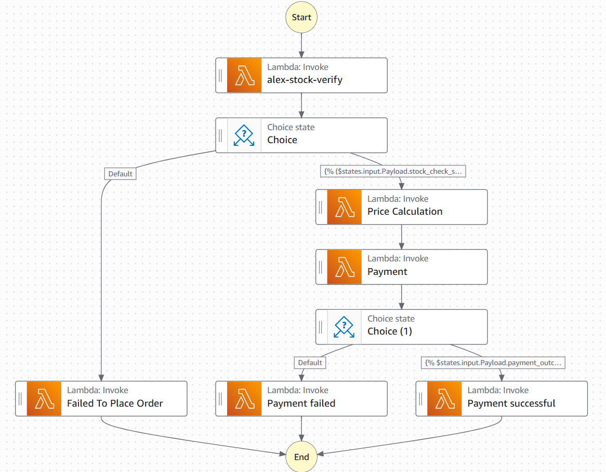

# StateMachineOrderApp

A serverless order processing system built with AWS Step Functions, Lambda, and DynamoDB that automates the entire order lifecycle from creation to completion.

## Overview

This application implements an event-driven architecture where creating an object in a DynamoDB table that acts like a trigger for an EventBridge rule that initiates the complete order processing workflow through a Step Function state machine.

## Architecture

### Database Tables
- **alex-orders**: Main orders table containing customer orders with `items[]` array
- **alex-inventory**: Inventory table linked to orders via `item_id`

### Workflow Components

#### API Gateway Routes
- **POST** `/orders` - Creates new order and initiates processing

#### State Machine Flow
The Step Function orchestrates the following Lambda functions:

1. **Stock Verification Lambda** (`alex-stock-verify`)
   - Validates order data and customer information
   - Checks inventory availability using `item_id`
   - **Choice State**: Success → Continue | Failure → Return `{400, "wrong credentials"}`

2. **Price Calculation Lambda**
   - Calculates total order price
   - Applies shipping logic:
     - Orders > 200: 20 shipping cost
     - Orders ≤ 200: 50 shipping cost
   - Decrements inventory stock

3. **Payment Processing Lambda**
   - Processes payment (random logic for simulation)
   - **Choice State**: Success → Continue | Failure → Return `{400, "payment failed"}`

4. **Order Completion Lambda**
   - Updates order status upon successful payment
   - Sends confirmation email
   - Finalizes the order

## State Machine Diagram

The diagram shows the complete workflow from order creation through stock verification, price calculation, payment processing, and final order completion with appropriate error handling at each step.

## Technology Stack

- **AWS Step Functions** - Workflow orchestration
- **AWS Lambda** - Serverless compute functions
- **Amazon DynamoDB** - NoSQL database for orders and inventory
- **Amazon EventBridge** - Event-driven triggers
- **Amazon API Gateway** - REST API endpoints

## Getting Started

1. Deploy the DynamoDB tables (`alex-orders`, `alex-inventory`)
2. Create the Lambda functions for each processing step
3. Configure the Step Function state machine
4. Set up EventBridge rules to trigger on order creation
5. Deploy API Gateway with POST endpoint
